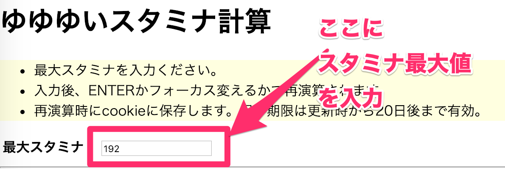

[gh-pages]:https://blatank.github.io/YuyuyuiStaminaCalc/index.html

# これはなに？
- ソシャゲ「結城友奈は勇者である 花結いのきらめき」(通称：ゆゆゆい)のスタミナ回復量計算をJavaScriptの勉強がてら作ったもの

## ご了承ください
- 勉強用なので今のところデザインとか**ございませぬ**。
- 放置時間中にスタミナ回復**しきらないように**計算したもの。
- それをぱっと暗算できる人には**必要ありません**。

## 使い方
大きく分けて2通り。
### Herokuに置いたのでこれにアクセスする
- https://yuyuyuistaminacalc.herokuapp.com/

#### (古)GitHub Pagesにアクセスしてそれを使う
- [GitHub Pagesに置いてあるもの][gh-pages]
- 注)Herokuに置くようにしたので、index.htmlを更新しなくなって古くなるかもしれません。

### cloneかForkして自分とこで使う
- ローカルでindex.htmlを開くと**cookie保存できない**かも知れません。そのときはWebサーバに置くか、付属のapp.jsからWebサーバを起動してください。要:node.js

#### node.jsからWebサーバを起動
1. **npm install**で必要な物をインストールください
2. **node app.js**でWebサーバが起動します。
3. ブラウザで**localhost:8000**にアクセスしてください。

## 仕様
- 現在のスタミナ最大値をエディットボックスに入力したら勝手にどれくらいで最大値に回復するか計算します。

- ○時間放置したいときは○○くらい以下にしておけば良いという表示もします。
- Cookieを使用しています。最後の更新から20日間有効にしています(適当)。
- Cookieは最大値スタミナ入力時に更新しています。
- 最大24時間放置までを演算してます(超適当)
- app.jsのWebサーバも**結構適当**に作ってます。ローカルで**デバッグできりゃいいや**レベル。
- テンプレートエンジンを使う勉強にPugを使っています。そのためindex.htmlは廃れていくと思います。

## 結城友奈は勇者である 花結いのきらめき
- 公式：https://yuyuyui.jp/
